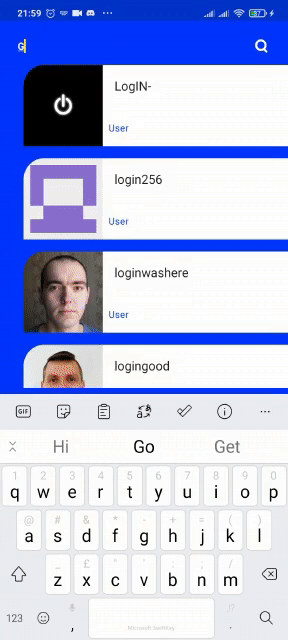

# Android Developer Test for Scal.Io

This app fetches a list of github users and displays the results in the UI. The app paginates the response. 

## Author

- [Ochuba Samuel](https://www.github.com/kolanse)

Getting Started
---------------
This project uses the Gradle build system.  Clone the project from GitHub and open it using Android Studio. 
This project was developed using Android Studio Artic Fox so make sure your IDE is updated. 
After cloning, make sure your device has internet connectivity and run the project.

Screenshots
-----------

Libraries Used
--------------
* [Architecture][10] - Jetpack architechure libraries. A collection of libraries 
 for managing app component lifecycles.
* [Android KTX][2] - Concise Kotlin code with less verbosity
* [Flow][17] flow for observing and collecting data across the app
* [Paging][11] Paging 3 implemenation for managing pagination
* [Lifecycles][12] - Monitor lifecycle events and update UI accordingly
* [Glide][90] for image loading and caching
* [Hilt][92]: for [dependency injection][93]
* [Room][16] - To Acess App's SQLite's database , equipped with compile time checks.
* [Kotlin Coroutines][91] for managing background threading with simplified code 
* [Test][4] - Android Testing Framework for unit and UI tests.

[0]: https://developer.android.com/jetpack/components
[2]: https://developer.android.com/kotlin/ktx
[4]: https://developer.android.com/training/testing/
[10]: https://developer.android.com/jetpack/arch/
[11]: https://developer.android.com/topic/libraries/architecture/paging/v3-migration
[12]: https://developer.android.com/topic/libraries/architecture/lifecycle
[16]: https://developer.android.com/topic/libraries/architecture/room
[17]: https://developer.android.com/topic/libraries/architecture/viewmodel
[18]: https://developer.android.com/kotlin/flow
[30]: https://developer.android.com/guide/topics/ui
[31]: https://developer.android.com/training/animation/
[34]: https://developer.android.com/guide/components/fragments
[35]: https://developer.android.com/guide/topics/ui/declaring-layout
[90]: https://bumptech.github.io/glide/
[91]: https://kotlinlang.org/docs/reference/coroutines-overview.html
[92]: https://developer.android.com/training/dependency-injection/hilt-android
[93]: https://developer.android.com/training/dependency-injection

## Documentation

The project is relatively straightforward with a little complexity around the paging 3 Implementation. The app has a local and remote package . Local helps cache the data that has been called from the api. The UserRemoteMediator is in charge of making the necessary network call to get users and cache gotten users from remote source. The UserviewModel monitors the current UI state and gives the neccessary instructructions to the repository in response to the UI actions. Monitoring  and collection of data is done with the aid of Flow

